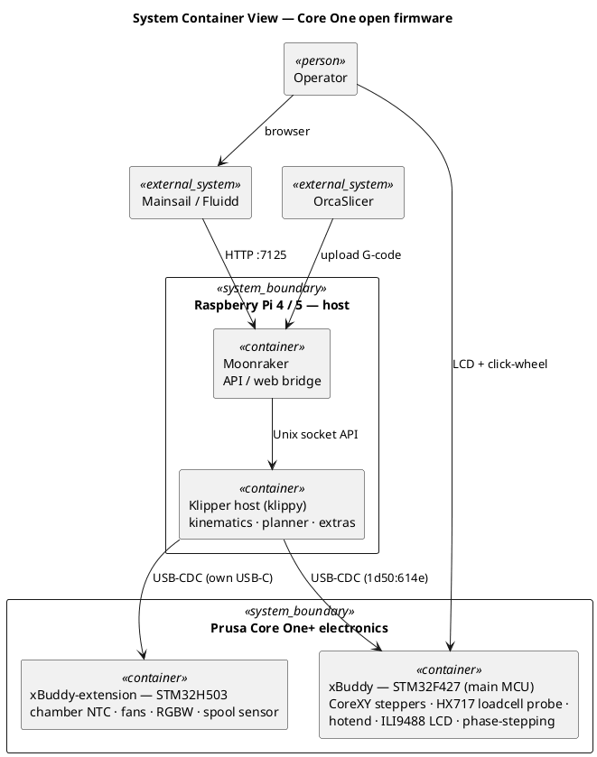
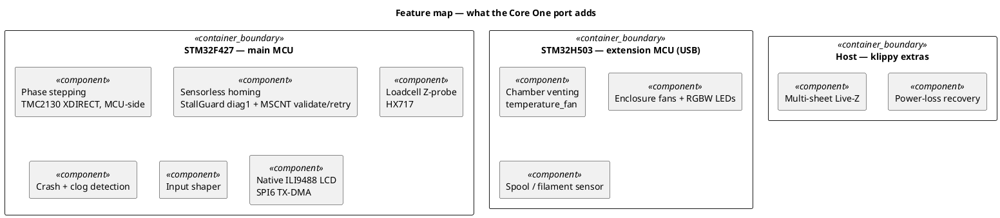

  <picture>
    <source media="(prefers-color-scheme: light)" srcset=".github/assets/coreone-mono-mark-black-256.png">
    
  </picture>

# coreone-firmware — Klipper for the Prusa Core One+

> **This is a fork** of **[Klipper](https://github.com/Klipper3d/klipper) (GPLv3)** carrying an
> open-firmware port for the **Prusa Core One / Core One+** (STM32F427 xBuddy + STM32H503
> xBuddy-extension). Upstream copyright and [license (GPLv3)](COPYING) are unchanged.
> See **[FORK.md](FORK.md)** for what's included + build/flash, and **[CHANGES.md](CHANGES.md)**
> for the modification disclosure (GPLv3 §5).
>
> ⚠️ **Community port — experimental, not affiliated with or endorsed by Prusa Research.**
> Flashing custom firmware is at your own risk. It coexists with the Prusa bootloader, so you
> can return to stock at any time — see [Installation](#installation).
>
> Questions, or want to chat about the Core One port rather than open an issue for every little
> thing? Drop into the Discord — there's a **#coreone-firmware** channel:
> **[discord.gg/vbNaQRQ4cs](https://discord.gg/vbNaQRQ4cs)**

## What this is

A full Klipper port for the Prusa Core One+, running on the **stock xBuddy electronics — no
hardware changes**. It installs *alongside* the Prusa bootloader (chainloaded), so returning to
stock firmware is just reflashing Prusa's `.bbf`. Both boards run as Klipper MCUs: the main
board (STM32F427) and the xBuddy-extension board (STM32H503) — each connected to the host over its
own USB link.

## Features

Most of what follows is a **port of Prusa's own Buddy-firmware behaviour rather than new invention** —
the work was getting it to run under Klipper on the stock electronics. A few of these happen to be
uncommon in the wider Klipper ecosystem, so parts of this may be of interest beyond Core One owners.

- **Phase stepping** — Prusa-style open-loop TMC2130 XDIRECT coil-current drive, executed on the
  MCU (~8 kHz). **On by default**, and runs with an *empty (uncalibrated) cogging LUT* — the same
  default as Prusa's own firmware — so it works **without** the accelerometer kit. Per-machine
  cogging compensation is optional (see [Per-machine calibration](#per-machine-calibration)).
  Mainline Klipper has no equivalent; prior art for the executor pattern is credited below.
- **Sensorless homing** — native StallGuard homing with MSCNT microstep-accurate landing
  (sub-step refinement on top of the usual full-step StallGuard result).
- **Loadcell Z-probe** — HX717 load cell for first-layer / mesh probing (as on stock). Built on
  Klipper's upstream `load_cell_probe`; the HX717 driver and its channel interleaving are ours.
- **Crash & clog detection** — StallGuard crash detection, plus loadcell **force-based** clog /
  e-stall detection (most Klipper setups use a filament-motion sensor for this instead).
- **Input shaper** — accelerometer-based resonance calibration (optional kit).
- **Chamber management** — native `temperature_fan` venting (the Core One has no chamber heater).
- **Multi-sheet Live-Z** — per-sheet first-layer offset storage.
- **Power-loss recovery.**
- **Native colour LCD** — ILI9488 320×480 TFT over SPI6 (TX-DMA) with the stock menu layout.
- **xBuddy-extension board** — enclosure fans, chamber NTC, RGBW LEDs and filament/spool sensor
  driven directly by Klipper as a second MCU over its own USB link. (Stock Prusa firmware reaches
  this hardware over Modbus/PuppyBus instead; here RS-485 is used only to *flash* the H503.)

See **[FORK.md](FORK.md)** for the full component list and build details.

## Architecture

  

The Pi host (Moonraker + klippy) drives **both** MCUs directly over USB-CDC, as two independent
Klipper MCUs: the **STM32F427** main board and the **STM32H503** enclosure board (which has its own
USB-C). There is no runtime bus between them — stock Prusa firmware talks to the extension over
Modbus/PuppyBus, whereas this port simply gives it to Klipper as a second MCU. The RS-485/PuppyBus
link is still used, but only as one of the ways to *flash* the H503. Where each capability runs:

Diagram sources (PlantUML) live in <a href="docs/diagrams/"><code>docs/diagrams/</code></a> — re-render with <code>plantuml -tpng &lt;file&gt;.puml</code>.

## Requirements

- **Printer:** Prusa Core One / Core One+ (xBuddy mainboard: STM32F427 main + STM32H503 extension).
- **Host:** Raspberry Pi **4** (2 GB+) minimum — validated (10+ prints). **Pi 5 recommended.**
  **Pi 3 is not recommended.** Klipper runs kinematics and step generation on the *host* CPU
  (single-threaded per MCU) and must deliver step timing ahead of real time — CPU-speed bound,
  and this port services *two* MCUs. With **phase stepping enabled** the host does extra
  real-time work on top of that: it applies input shaping and streams the shaped trajectory to
  the MCU continuously (the MCU handles only the coil-current commutation), plus ongoing loadcell
  force-FIR (clog detection) and filament-sensor processing during prints. That added host load is
  why a Pi 3's slower cores are marginal ("Timer too close" / segment starvation). With phase
  stepping disabled the load is close to stock Klipper, and a Pi 3 would likely cope.
- **USB ports — plan for this.** Both MCUs take a USB port (the F427 *and* the H503, which has its
  own USB-C). A Pi 4 has four ports total, so a typical build fills every one:
  `F427 + H503 + camera + SSD = 4`. Add anything else and you need a powered hub.
  **A Pi 5 solves this: the SSD moves off USB onto the PCIe 2.0 ×1 FFC connector (NVMe), so all
  four USB ports stay usable** — MCUs, camera and a spare. If you want, a camera can move off USB
  too, onto one of the **two 4-lane MIPI CSI connectors**. The Pi 5's USB 3.0 ports also each get
  full bandwidth, where the Pi 4's two USB 3.0 ports share a single PCIe Gen 2 ×1 link (VL805).
  And the faster CPU (2.4 GHz A76 vs 1.5 GHz A72) directly helps the host-side load described
  above. Note the Pi 5 wants a 5 V/5 A USB-PD supply.
- **Accelerometer: optional.** Phase stepping ships default-on with an empty cogging LUT (Prusa's
  uncalibrated default), so it runs *without* the input-shaper/accel kit. The kit is only needed
  for optional per-machine cogging + input-shaper calibration.

## Shopping list

**To install and run it** — no soldering, no debug probe:

| Item | Notes |
|---|---|
| Prusa Core One / Core One+ | stock xBuddy electronics, no hardware modification |
| Raspberry Pi 4 (2 GB+) or **Pi 5** | + PSU and storage; see the USB note above |
| 2 × USB cables | one per MCU (F427 and H503) |
| USB stick | to flash the `.bbf` from the printer's own menu |
| Something to snap the appendix | it's a breakaway PCB tab — see [Installation](#installation) |

**To develop, or to recover a bricked board** — this is where it gets fiddly, because the SWD
headers are *not fitted from the factory*:

| Item | Notes |
|---|---|
| **ST-LINK V3** (we used an STLINK-V3MINIE) | Whatever probe you use, the thing that actually matters is **solid contact** — flaky SWD sessions here traced back to a hand-made connector, not the probe. |
| **Samtec FTSH-105-01-L-DV-K-A-P-TR** + soldering iron | 1.27 mm 2×5 Cortex-debug header. The F427's **J21 footprint is unpopulated**, so SWD on the main board means soldering this on (and wiring NRST). |
| **Tag-Connect TC2030-CTX-STDC14** (~€50) | For the **H503**, whose **J9 TC2030 footprint is DNF (bare pads)** — the cable's pogo pins press onto them, so no soldering. Alternatively cold-solder to PA13/PA14. |
| ST-fork OpenOCD | Mainline OpenOCD has **no STM32H5 target**, so the H503 needs ST's fork. |

You do **not** need any of the second table for normal use — the `.bbf`/USB-stick path covers
installing, updating and returning to stock. It's for firmware development and for the case where
you need to talk to a board that won't boot.

## Installation

> **One-time prerequisite — break the appendix.** On a factory board the appendix (a small
> breakaway PCB tab, wired to PA13/SWDIO on the xBuddy) keeps the Prusa bootloader locked to
> *signed* Prusa firmware. You must snap it off once to allow custom/unsigned firmware — this is
> Prusa's own requirement for **any** custom firmware
> ([Prusa guide](https://help.prusa3d.com/article/zoiw36imrs-flashing-custom-firmware)). It's a
> one-way, permanent snap (Prusa's tamper flag) and it also enables SWD. Returning to stock
> firmware still works afterwards; the appendix itself does not grow back.

Once the appendix is broken, the firmware installs like a normal Prusa update: it's delivered as
an (unsigned) **`.bbf`** — copy it to a USB stick and flash it from the printer's own menu. It
installs alongside the Prusa bootloader (chainloaded) and does **not** overwrite the bootloader, so
you can reflash Prusa's official (signed) `.bbf` from USB to return to stock at any time — the
appendix break is the only permanent change.

Prebuilt images are attached to each **[GitHub Release](../../releases)**. Full build + flash
instructions (SWD / DFU / BBF / RS-485) are in **[FORK.md](FORK.md)** and
`coreone/docs/OWNERS_GUIDE.md`.

## Host configuration

Printer *configuration* (`printer.cfg`, `boards/xbuddy.cfg`, `h5/extension.cfg`) is **not** in
this repo — it carries machine-specific serials and lives host-side. The Moonraker + Klipper
host setup (Ansible) is published separately at
**[coreone-host](https://github.com/packerlschupfer/coreone-host)**.

## Per-machine calibration

The firmware runs out of the box with sane defaults. For the last few percent of quality, these
are calibrated **per machine** and stored host-side (see
[coreone-host](https://github.com/packerlschupfer/coreone-host)):

- **Cogging compensation** — measured with the accelerometer; refines phase-stepping smoothness.
  Optional; phase stepping runs fine uncalibrated.
- **Input shaper** — resonance frequencies (accelerometer).
- **Loadcell / Live-Z** — first-layer offset per sheet.

## Credits

- **[Klipper](https://github.com/Klipper3d/klipper)** by Kevin O'Connor and contributors
  (GPLv3) — the firmware this port is built on.
- **Prusa Research** — the Core One hardware and the Buddy firmware whose behaviours (phase
  stepping, loadcell probing, crash detection) this port mirrors.
- The phase-execution timer pattern is adapted from Argo's Snapmaker-U1 executor.

## License

**GPLv3**, unchanged from upstream Klipper — see [COPYING](COPYING). Modifications are disclosed
in [CHANGES.md](CHANGES.md) per GPLv3 §5.

---

Upstream's original README follows.

Welcome to the Klipper project!

https://www.klipper3d.org/

The Klipper firmware controls 3d-Printers. It combines the power of a
general purpose computer with one or more micro-controllers. See the
[features document](https://www.klipper3d.org/Features.html) for more
information on why you should use the Klipper software.

Start by [installing Klipper software](https://www.klipper3d.org/Installation.html).

Klipper software is Free Software. See the [license](COPYING) or read
the [documentation](https://www.klipper3d.org/Overview.html). We
depend on the generous support from our
[sponsors](https://www.klipper3d.org/Sponsors.html).
